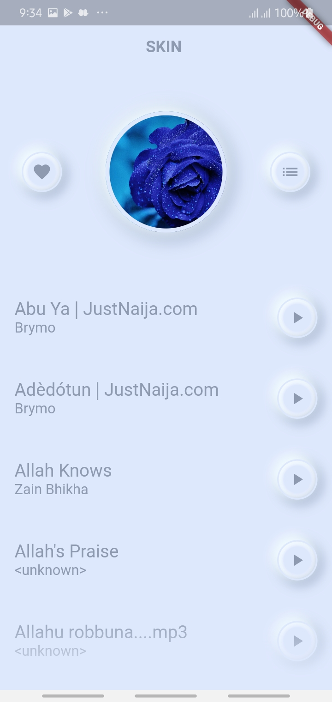
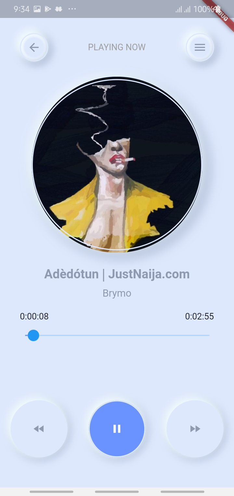

# music_app
Flutter UI challenge.
i saw this design on dribbble https://dribbble.com/shots/9517002--Light-Mode-Simple-Music-Player/attachments/1542953?mode=media
and i decided to bring it to life with palyback functionality. i know its not exactly the same buhh..

   

A new Flutter project.

## Getting Started

This project is a starting point for a Flutter application.

A few resources to get you started if this is your first Flutter project:

- [Lab: Write your first Flutter app](https://flutter.dev/docs/get-started/codelab)
- [Cookbook: Useful Flutter samples](https://flutter.dev/docs/cookbook)

For help getting started with Flutter, view our
[online documentation](https://flutter.dev/docs), which offers tutorials,
samples, guidance on mobile development, and a full API reference.
